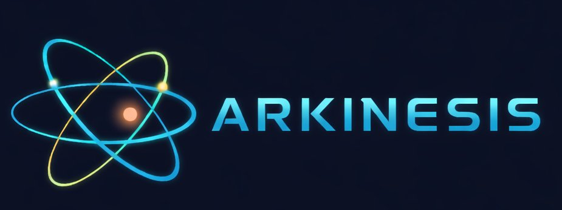

#ARKINESIS

**Motor de exploración educativa interactiva.**

ARKINESIS es una plataforma basada en simulaciones que permite aprender observando fenómenos, modificando variables y construyendo comprensión a partir de la experimentación.

No es un curso.

No es un sistema de evaluación.

No es un LMS.

Es un laboratorio interactivo donde el aprendizaje surge de la exploración.

---

## Filosofía

La idea central es sencilla:

```text
Experimentar
↓
Observar
↓
Descubrir
↓
Comprender
```

Si una simulación consigue que un estudiante diga:

> "Ahora entiendo por qué ponen triángulos en los puentes."

entonces la simulación ha cumplido su propósito.

ARKINESIS prioriza la comprensión conceptual sobre la memorización.

La simulación es siempre el elemento principal.

Las explicaciones aparecen después.

---

## Ecosistema

### Simulación

Es el núcleo de ARKINESIS.

Cada simulación permite modificar parámetros y observar cómo cambia un fenómeno.

El aprendizaje debe surgir primero de la observación.

---

### 🦎 AX0

AX0 es el compañero curioso de ARKINESIS.

Su función es despertar curiosidad mediante datos interesantes y conexiones inesperadas.

AX0 no evalúa.

AX0 no explica teoría.

AX0 acompaña la exploración.

---

### 🌀 KORU

KORU es el intérprete de ARKINESIS.

Su función es ayudar a transformar observaciones en comprensión.

Cuando una simulación despierta una pregunta, KORU ayuda a formularla y aporta el contexto necesario para obtener explicaciones más útiles.

```text
ARKINESIS
↓
Muestra qué ocurre

KORU
↓
Ayuda a entender por qué ocurre
```

Inspirado en el símbolo maorí del koru, representa:

- crecimiento

- aprendizaje

- exploración

- comprensión

- volver al mismo lugar entendiendo algo más

---

## Arquitectura

ARKINESIS utiliza una arquitectura declarativa basada en YAML.

```text
YAML
↓
Motor
↓
Renderer
↓
Experiencia interactiva
```

Cada simulación define:

- Variables

- Constantes

- Fórmulas

- Insights

- Conexiones contextuales

El motor genera automáticamente:

- Controles

- Resultados

- Estado compartible

- Integración con KORU

---

## Módulos actuales

### Física

- Campo Magnético

- Inducción Magnética

- Efecto Doppler

- Óptica

- Gravitación

- Ondas

- Electromagnetismo

### Tecnología

- Palancas

- Poleas

- Engranajes

- Correas

- Triangulación

---

## KORU Bridge

Todas las simulaciones exponen un estado estructurado mediante:

```javascript
exportState()
```

Este estado permite generar automáticamente preguntas contextualizadas para KORU.

Objetivo:

Reducir la distancia entre:

```text
"No entiendo esto"
```

y

```text
"Puedo formular una buena pregunta"
```

---

## Crear una nueva simulación

1. Crear un archivo YAML.

2. Definir variables, fórmulas e insights.

3. Implementar un renderer.

4. Registrar la simulación.

No requiere backend.

No requiere base de datos.

No requiere servicios externos.

---

## Objetivo del proyecto

ARKINESIS busca construir un entorno donde:

- experimentar sea fácil

- preguntar sea natural

- comprender sea más accesible

Porque aprender suele empezar cuando alguien observa algo extraño y piensa:

"Espera... ¿por qué ocurre eso?"

## Cómo funciona

1. El YAML define la física: variables, rangos, constantes, fórmulas
2. El motor genera los sliders automáticamente
3. El renderer dibuja la visualización
4. La URL refleja el estado actual → se puede compartir

## Compartir un ejercicio concreto

Mueve los sliders a los valores del enunciado y pulsa **⎘ copiar enlace**.  
La URL generada carga la herramienta con esos valores precargados.

Ejemplo:

```
https://[usuario].github.io/fisica-interactiva/?formula=campo_magnetico&B=0.5&v=2&theta=60
```

## Añadir una nueva fórmula

### 1. Crear el YAML en `/formulas/`

```yaml
id: mi_formula
titulo: Nombre del fenómeno
renderer: mi_formula
descripcion: Descripción breve para el alumno.

variables:
  x:
    label: Variable X
    unidad: m
    min: 0
    max: 10
    step: 0.1
    default: 5

constantes:
  k:
    label: Constante
    valor: 9e9
    unidad: N·m²/C²

formulas:
  - id: resultado
    label: Nombre del resultado
    expr: "k * x * x"   # expresión JS válida, usar · para multiplicar
    unidad: J
    destacado: true
```

### 2. Crear el renderer en `/renderers/mi_formula.js`

```javascript
window.Renderers = window.Renderers || {};

window.Renderers.mi_formula = (() => {
  let c1, c2, ctx1, ctx2;

  function init(canvas1, canvas2) {
    c1 = canvas1; c2 = canvas2;
    ctx1 = c1.getContext('2d');
    ctx2 = c2.getContext('2d');
  }

  function draw(valores, resultados, formula) {
    // valores: { x: 5, ... }  (valor del slider, sin escala)
    // resultados: { resultado: 225000000000, ... }
    // Dibujar en ctx1 (vista principal) y ctx2 (vista secundaria)
  }

  return { init, draw };
})();
```

### 3. Registrar en motor.js

En `FORMULAS_DISPONIBLES`:

```javascript
{ id: 'mi_formula', label: 'Nombre en el selector' },
```

## Versionado del temario

Usa tags de git para versiones por año:

```
git tag BACH.2.26
git tag BACH.1.26
```

## Deploy en GitHub Pages

1. Fork o crea el repo
2. Settings → Pages → Branch: main, carpeta: / (root)
3. Listo. La URL será `https://[usuario].github.io/[repo]/`

No necesita build, no necesita servidor, funciona con ficheros estáticos.
## License philosophy

This simulator is released under GPL-3.0 to guarantee that it remains free and accessible.

You may use, modify and redistribute it, including commercially, 
but any distributed version must also provide the complete source code 
under the same license.

If you build upon this work, please contribute improvements back to the project.
